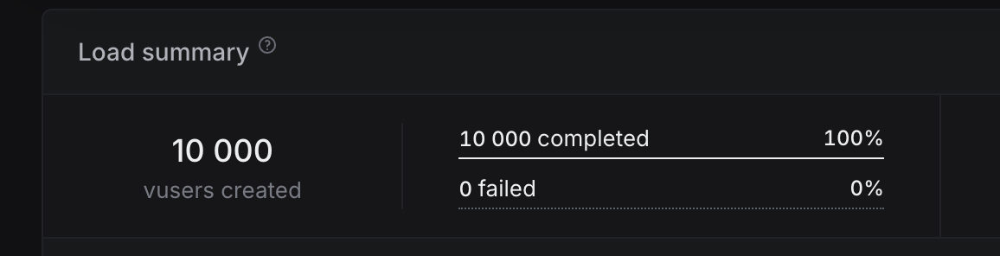
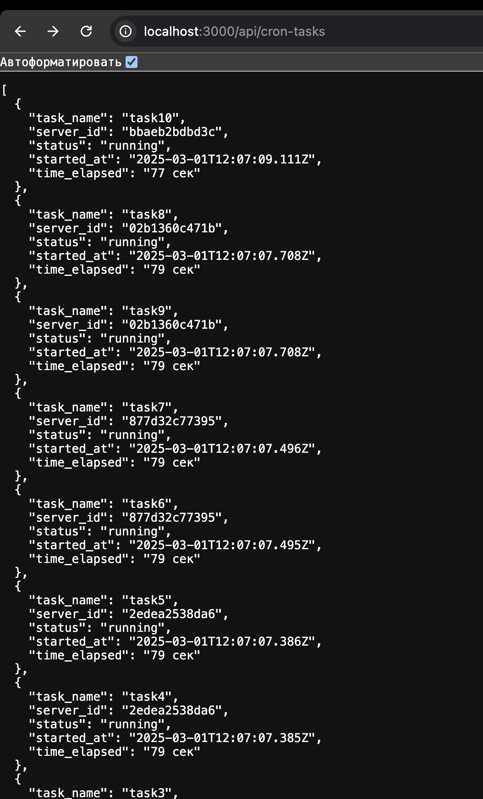

# HighLoad 10000/second express app w/ database Postgre

## 🚀 Quick Start

### Prerequisites

- Install [Node.js](https://nodejs.org)
- Artillery account for test. [Artillery](https://www.artillery.io/)
- Terminal `bash/powershell` to install dependencies and run
- [Docker](https://www.docker.com/)
- [Redis](https://redis.io/)

[Artillery test](https://app.artillery.io/share/sh_cffc75c7195c1263a2527156b9cadc22dd126a242038ab688e878ae07599d5c9)

## 📦 Run highload

1. **Load npm dependencies**

```shell
npm install
```

2. **If you need Artillery**

```shell
npm install -g artillery
```

3. **Create `.env` file and set env variables**

```
PORT=3000

# redis
REDIS_HOST=localhost
REDIS_PORT=6379

# postgres
POSTGRES_USER=postgres
POSTGRES_PASSWORD=
POSTGRES_DB=
PG_HOST=localhost
PG_PORT=5432
```

4. **Start server**

```shell
npm run start
```

## 📸 Screenshot



## 📦 Run multi service

1. **Load npm dependencies**

```shell
npm install
```

2. **Create `.env` file and set env variables**

```
PORT=3000

# redis
REDIS_HOST=localhost
REDIS_PORT=6379

# postgres
POSTGRES_USER=postgres
POSTGRES_PASSWORD=
POSTGRES_DB=
PG_HOST=localhost
PG_PORT=5432
```

3. **Start server**

```shell
docker compose up --build --scale app=5
```

## 📸 Screenshot



## 🎮 Usage

1. **Try it (highLoad)**

- Try w/ benchmarkers. For example [Artillery](https://www.artillery.io/)

```shell
artillery run ./test/artilerry-test.yml  --record --key YOUR_KEY
```

2. **Try it (multi-service)**

- Run by instruction above
- Open [localhost](http://localhost:3000/api/cron-tasks) to see which cron task run on which server (of 5)

### Powered

- [Artillery](https://www.artillery.io/)
- [Express](https://expressjs.com/)
- [ChatGPT help](https://chatgpt.com/share/67b32970-c1e0-800d-af23-cdfdded57639)
- [Docker](https://www.docker.com/)
- [Redis](https://redis.io/)
